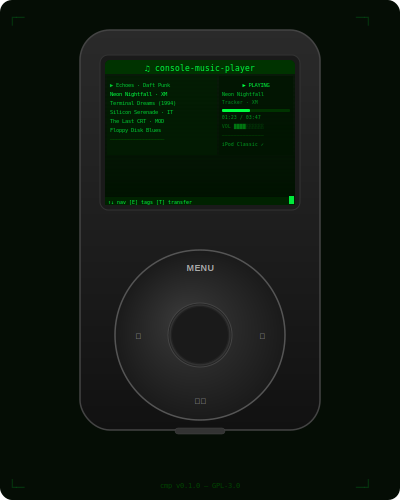

# console-music-player

<p align="center">
  
</p>

A cross-platform terminal music player with iPod Classic / Shuffle support,
MOD tracker playback, and a numerology-based track selector, written in Rust.

---

## Features

- Full-featured TUI (ratatui): library browser, player pane, waveform pane, device pane
- Local library scanner: MP3, M4A, AAC, FLAC, OGG, Opus, WAV, AIFF
- **Magic-byte format verification** — extension mismatches rejected at import time
- **MOD tracker support**: MOD, XM, IT, S3M, MO3 and 20+ legacy formats (optional — see below)
- Real-time **waveform oscilloscope** (`[V]`) — Unicode half-block characters (▀ ▄ █)
- **Live search** (`[/]`) — searches title, artist, album, year, tags, playlists, and filename; shows matched fields inline
- **Gematria track selector** (`[\]`) — type any word or phrase; classic numerology systems compute a value and select a track to play; inspired by [cosmic-knowledge](https://github.com/sormondocom/cosmic-knowledge)
- **Sort & group presets** (`[Z]`): by artist, album, year, month, file extension, or user tags
- **Duplicate finder** (`[F]`): exact-content and metadata-match detection with per-track keep/delete UI
- **User tag library** (`[G]`): tag any track with custom keywords; filter and group by tag
- In-place tag editor (`[E]`): title, artist, album, year, genre
- Playlist badges and tag badges shown inline in the track list
- iPod Classic / Nano / Mini / Shuffle upload via USB Mass Storage
- iTunesDB & iTunesSD read/write — no iTunes required
- iPod health scan and database repair
- **Amazon Music** easter egg — catalog browser and MP3 downloader (session-cookie based)
- **P2P music sharing** (beta) — share your library with trusted peers on the same network or over the internet; stream tracks in-memory and vote on synchronized group playback via the Party Line
- Playlists saved as JSON; single-track repeat
- **Ctrl+V paste** in all text input fields (desktop platforms)
- **mpv fallback** for audio playback on Termux (when the native backend is unavailable)

---

## Platform support

| Platform | Standard audio | Tracker (MOD/XM/IT…) | iPod transfer |
|----------|:---:|:---:|:---:|
| **Windows 10/11** (x86-64) | ✅ | ✅ (DLLs bundled) | ✅ |
| **Linux** (x86-64, aarch64) | ✅ | ✅ (`apt`/`dnf`/`pacman`) | ✅ |
| **macOS** (x86-64, Apple Silicon) | ✅ | ✅ (`brew`) | ✅ |
| **Android — Termux** (aarch64) | ✅ via `mpv` | ✅ (`pkg install libopenmpt`) | ⚠️ (USB limited) |

> iPod transfer on Android depends on the device exposing the iPod as USB Mass
> Storage. Many modern Android phones require a USB-OTG adapter and a file
> manager that mounts the device at a known path.

---

## Dependencies

### Required — always (no system libraries needed)

- **Rust 1.75+** — [rustup.rs](https://rustup.rs)
- All audio decoding (MP3, FLAC, AAC, OGG, WAV, AIFF) is handled by
  [symphonia](https://github.com/pdeljanov/Symphonia) via Cargo — no system
  library required.

### Optional — MOD tracker playback (`--features tracker`)

Tracker playback links against **libopenmpt**, a C++ library.  Install it for
your platform before passing `--features tracker`.

#### Windows

Pre-built DLLs are bundled in `deps/` — no package manager needed.  See
[Setting up deps/ on Windows](#setting-up-deps-on-a-new-machine-windows) in the
Developer Notes section.

#### Linux

```bash
# Debian / Ubuntu / Raspberry Pi OS
sudo apt install libopenmpt-dev

# Fedora / RHEL / CentOS Stream
sudo dnf install libopenmpt-devel

# Arch Linux / Manjaro
sudo pacman -S libopenmpt
```

#### macOS

```bash
brew install libopenmpt
```

#### Android — Termux

```bash
pkg install libopenmpt
```

libopenmpt links against Android's shared C++ runtime (`libc++_shared.so`).
The project's `.cargo/config.toml` adds the correct linker flag automatically —
no extra steps needed after the `pkg install`.

---

## Android / Termux setup

### Audio playback

The native audio backend (`cpal`/`rodio`) cannot reach the Android audio system
from a plain Termux terminal process.  `cmp` automatically falls back to **mpv**
as an external audio process.  Install it once:

```bash
pkg install mpv
```

That's it.  When `cmp` starts it probes `PATH` for `mpv` and routes all
playback through it.  Pause, resume, stop, and volume control all work normally.

> **Note:** The waveform oscilloscope (`[V]`) requires the native rodio backend
> and is unavailable on the mpv path.

### Accessing Internal Storage

Android sandboxes Termux away from `/storage/emulated/0` (Internal Storage) by
default.  Run this once to grant access and create the storage symlinks:

```bash
termux-setup-storage
```

Accept the permission popup when prompted.  This creates `~/storage/` with
ready-to-use symlinks:

| Symlink | Points to |
|---------|-----------|
| `~/storage/shared` | `/storage/emulated/0` (full Internal Storage) |
| `~/storage/music` | `/storage/emulated/0/Music` |
| `~/storage/downloads` | `/storage/emulated/0/Download` |
| `~/storage/dcim` | `/storage/emulated/0/DCIM` |

On first launch **`cmp` automatically detects and adds** a music source in this
priority order:

1. `~/storage/music` — the dedicated Music symlink (preferred)
2. `~/storage/shared/Music` — the Music folder inside full Internal Storage
3. `~/Music` — home directory Music folder (fallback)

To add other folders, press `[S]` → `[A]` and enter the path.  Tilde paths
are expanded automatically, so you can type either:

```
~/storage/shared/Podcasts
/storage/emulated/0/Podcasts
```

> If you see *"Not a directory"* when entering a `/storage/...` path, run
> `termux-setup-storage` first and restart `cmp`.

### Quick-start on Termux

```bash
# 1. One-time setup (do this once, ever)
pkg install rust mpv
termux-setup-storage   # accept the permissions popup

# 2. Optional: tracker support
pkg install libopenmpt

# 3. Build and run
cargo build --release
./target/release/cmp
```

---

## Building

```bash
# Full build — tracker included by default (requires libopenmpt — see above)
cargo build --release

# Without tracker — pure Rust, no C++ dep, works anywhere without libopenmpt
cargo build --release --no-default-features

# Run directly from source with a music library path
cargo run -- --library /path/to/Music
```

> **Windows users:** the VS Code default tasks (Ctrl+Shift+B / Ctrl+Shift+P →
> Run Task) build with `--features tracker` and copy the bundled DLLs
> automatically.

> **Termux users:** install libopenmpt first (`pkg install libopenmpt`), then
> `cargo build` gives the full player including tracker support. If you prefer
> not to install libopenmpt, use `cargo build --no-default-features`.

---

## Controls

### Library screen

| Key | Action |
|-----|--------|
| `↑` / `↓` or `k` / `j` | Navigate tracks |
| `Page Up` / `Page Down` | Jump 10 tracks |
| `Enter` | Play focused track |
| `Space` | Toggle track selection (for transfer / playlist) |
| `P` | Pause / resume |
| `[` / `]` | Volume down / up |
| `O` | Toggle single-track repeat |
| `V` | Toggle waveform oscilloscope |
| `/` | Open live search overlay |
| `\` | Open gematria track selector |
| `Z` | Cycle sort / group-by preset |
| `Tab` | Switch focus: Library ↔ Device pane |
| `E` | Edit metadata tags (title, artist, album, year, genre) |
| `G` | Edit user keyword tags for focused track |
| `F` | Find duplicates |
| `S` | Manage source directories |
| `L` | Browse / load playlists |
| `W` | Save current selection as playlist |
| `R` | Rescan library (or clear active playlist filter) |
| `D` | Rescan connected devices |
| `T` | Transfer selected tracks to iPod |
| `I` | Browse iPod track library |
| `X` | Scan iPod health |
| `N` | Initialise fresh iTunesDB on iPod |
| `U` | Dump iTunesDB contents to transfer log |
| `Q` | Quit |

### Sort / Group-by presets (`Z`)

Pressing `Z` cycles through these presets in order:

| Preset | Behaviour |
|--------|-----------|
| Original Order | Restore initial scan order |
| Artist / Album | Artist → Album → Title (default) |
| Title | Alphabetical by title |
| Album | Album → Title |
| Duration ↓ | Longest tracks first |
| Date Added | Newest file first (by mtime) |
| Group by Extension | Sections: FLAC, IT, MOD, MP3, XM … |
| Group by Artist | Sections per artist name |
| Group by Year | Sections per release year (unknown last) |
| Group by Month | Sections per mtime year · month |
| Group by Tag | Sections per user tag (untagged last) |

### Live search overlay (`/`)

Results update on every keystroke.  Each result shows the track and a badge
indicating which fields matched, e.g. `[Artist · Tag]`.

Fields searched: **Title, Artist, Album, Year, user Tags, Playlist name, File name**

| Key | Action |
|-----|--------|
| Any character | Append to search query |
| `Backspace` | Delete last character |
| `Ctrl+V` | Paste from clipboard |
| `↑` / `↓` or `k` / `j` | Navigate results |
| `Page Up` / `Page Down` | Jump 10 results |
| `Enter` | Jump to selected track in library |
| `Esc` | Close without navigating |

Results are ranked: exact title matches first, then exact artist matches, then
remaining matches in scan order.

### Gematria track selector (`\`)

Select a track to play using numerological values derived from a word or phrase.
The system is ported from the [cosmic-knowledge](https://github.com/sormondocom/cosmic-knowledge)
numerology module.

Type any word, name, or phrase — the overlay computes the gematria value
across four classical systems and maps each result to a track in your library.

| System | Method |
|--------|--------|
| **Hebrew Gematria** (Mispar Hechrachi) | Traditional Hebrew letter values (A=1, B=2, K=20, L=30 …) |
| **Pythagorean** | Western cyclical assignment (A/J/S=1, B/K/T=2 …) |
| **Chaldean** | Babylonian vibrational system (values 1–8 only, no 9) |
| **Simple Ordinal** | A=1 through Z=26 |

The phrase total (not the reduced root) is used as the track index
(`total mod library_size`) so the full numeric value spreads across your entire
library.  The digital root (1–9, preserving master numbers 11, 22, 33) is shown
alongside an interpretive meaning.

| Key | Action |
|-----|--------|
| Any character | Append to phrase |
| `Backspace` | Delete last character |
| `Ctrl+V` | Paste from clipboard |
| `Tab` | Cycle through the four systems |
| `Enter` | Jump to the selected track and play it |
| `Esc` | Cancel, return to library |

The overlay updates live as you type, showing all four system results at once
with the active system highlighted.

### Metadata tag editor (`E`)

| Key | Action |
|-----|--------|
| `Tab` / `↓` / `j` | Next field |
| `↑` / `k` | Previous field |
| `Enter` | Save tags to file |
| `Esc` | Cancel, discard changes |

Fields: Title, Artist, Album, Year, Genre.

### User tag editor (`G`)

| Key | Action |
|-----|--------|
| Any character | Append to tag input |
| `Backspace` | Delete last character |
| `Ctrl+V` | Paste from clipboard |
| `Enter` | Save tags to disk |
| `Esc` | Cancel, discard changes |

Tags are comma-separated keywords (e.g. `rock, 80s, favourite`).  They are
normalised to lowercase and deduplicated on save.  Tags appear as `#tag` badges
inline in the track list and can be grouped with `Z → Group by Tag`.

### Duplicate finder (`F`)

| Key | Action |
|-----|--------|
| `↑` / `↓` or `k` / `j` | Navigate duplicate groups (left panel) |
| `Tab` | Switch focus: group list ↔ candidates |
| `Space` | Cycle action for focused candidate (Keep / Delete) |
| `A` | Auto-suggest best action for all groups |
| `Enter` | Execute all Delete actions |
| `Esc` | Cancel, return to library |

### Waveform oscilloscope (`V`)

Replaces the library pane with a real-time oscilloscope trace of the playing
audio.  Uses Unicode half-block characters (▀ ▄ █ space) for double vertical
resolution.  Press `V` or `Esc` to return to the library.

> Not available when using the mpv fallback backend (Termux without native audio).

### Amazon Music (easter egg)

Type the key sequence `A` → `C` → `E` within 2 seconds from the library screen
to open the Amazon Music catalog browser.  This feature requires a valid
`music.amazon.com` session cookie — you will be prompted to paste one on each
session start (cookies are session-scoped and expire).

**How to get your cookie:**
1. Open `music.amazon.com` in a browser and sign in
2. Press `F12` → Network tab → click any request
3. Under Request Headers, right-click the `cookie:` value → Copy value
4. Paste it into `cmp` with `Ctrl+V` when prompted

| Key | Action |
|-----|--------|
| `Tab` | Switch focus: Amazon catalog ↔ Local library |
| `↑` / `↓` or `k` / `j` | Navigate tracks |
| `Page Up` / `Page Down` | Jump 10 tracks |
| `D` | Download focused Amazon track as MP3 |
| `R` | Refresh / re-fetch catalog |
| `?` | Open diagnostic log (full HTTP exchange dump) |
| `Esc` | Close diagnostic log / return to library |

The diagnostic log (`?`) shows the complete untruncated HTTP exchange for any
failed request — method, URL, all request headers, HTTP status code, all
response headers, and the full response body.  This is especially useful for
diagnosing expired-cookie 404 responses where Amazon returns an HTML error page
instead of JSON.

### P2P music sharing (beta)

Activate by pressing `p` → `2` → `p` within two seconds from any screen.

**First-time setup:** on the very first activation you will be asked to choose a
**display name** — a short identifier for your node on the P2P network.  Rules:

- 1 to 12 characters
- Letters and digits only (`a-z`, `A-Z`, `0-9`) — no spaces or symbols
- You can use the same name as another person; the app automatically appends a
  4-character key suffix to distinguish you: `Alice#A1B2` vs `Alice#C3D4`

Once confirmed the name is saved to `config.json` and never asked again.  To
change it later, edit or delete the `"p2p_nickname"` field in `config.json` (see
[Configuration file location](#configuration-file-location)) and restart.

On first activation a PGP identity is also generated and saved to `config.json`.
Subsequent activations reuse the stored key.

Once active, `cmp` announces itself to the local network via **mDNS**
(multicast DNS) and a supplementary **UDP directed-broadcast beacon** sent to
every network interface every 2 seconds — no configuration required.  Peers on
the same Wi-Fi or LAN are discovered automatically within a few seconds even
on multi-homed hosts (VPN + Ethernet, Docker bridges, etc.).

For **internet peers** outside your local network, share your listen address
(shown at the top of the P2P Peers screen) with the remote person out-of-band,
and use the `C` key to enter their address.  The peer still enters the
**Pending** state and must be explicitly approved before any data is exchanged.

On activation, `cmp` automatically attempts to open a port on your router via
**UPnP** (Universal Plug and Play).  If your router supports it, a cyan toast
confirms exactly which port was opened and what external address internet peers
can use.  If UPnP is unavailable, a yellow toast tells you which port to
forward manually.

Transport is encrypted end-to-end by the Noise XX protocol over TCP + QUIC.
Peers must explicitly approve each other before any library or track data is
exchanged.

#### Trust model

Every peer has one of four states:

| State | Meaning |
|-------|---------|
| **Pending** | Key announced; awaiting your approval |
| **Trusted** | Library sharing and track streaming enabled |
| **Rejected** | All messages from this peer are ignored |
| **Deferred** | Not yet decided; no data exchanged |

#### Typical workflow — step by step

The following walks through a complete P2P session between two people, Alice
and Bob, from first launch to synchronized group playback.

---

**Step 1 — Alice activates P2P**

Alice presses `p`, then `2`, then `p` (all within two seconds) from the library
screen.

Because this is her first time, she is taken to the **identity screen** and
prompted to type a display name.  She types `Alice` and presses `Enter`.

`cmp` saves the name, generates a PGP keypair, and writes both to `config.json`.
The status bar shows:

```
⬡ P2P active — Alice#A3F7  Discovering peers…
```

The `#A3F7` suffix is derived from the last four characters of her PGP
fingerprint.  Two users both named `Alice` would appear as `Alice#A3F7` and
`Alice#B82C` — always distinguishable.

The P2P Peers screen opens automatically.  It is empty — no peers have been
seen yet.

---

**Step 2 — Bob activates P2P (same local network)**

Bob does the same on his machine.  Both machines are on the same Wi-Fi network.

Within a few seconds, the UDP broadcast beacon discovers both nodes automatically.
Alice's Peers screen shows a new entry:

```
  ● Bob#B82C   [pending]
```

Bob's screen simultaneously shows:

```
  ● Alice#A3F7   [pending]
```

A cyan toast appears on each screen: `"New peer: Bob#B82C — press A to approve"`
(and vice versa for Bob).

At this point no library data or audio has been shared.  Both peers are in the
**Pending** state and the only thing each knows about the other is their
nickname and public key fingerprint.

---

**Step 2 (alternative) — Bob is on a different network (internet peer)**

If Bob is not on the same local network, mDNS cannot reach him.  Instead:

1. Alice looks at the top of her P2P Peers screen.  It shows her listen
   addresses, for example:
   ```
   /ip4/203.0.113.10/tcp/7878/p2p/12D3KooWAbc…
   ```
2. Alice sends that string to Bob out-of-band (chat, email, etc.).
3. Bob presses `C` in his P2P Peers screen, pastes Alice's address, and presses
   `Enter`.
4. Alice presses `C` in her P2P Peers screen, enters Bob's address, and presses
   `Enter`.
5. Bob appears as **Pending** in Alice's list (and vice versa) — identical to
   the LAN case from here on.

> **Port note:** On activation, `cmp` tries UPnP automatically — if your
> router supports it, the port is opened for you and your external address
> appears in the Peers screen.  If UPnP fails, a yellow toast tells you which
> port to forward manually.  To use a fixed, predictable port, set
> `"p2p_listen_port": 7878` in `config.json` (recommended for internet use).

---

**Step 3 — mutual approval**

Alice looks at Bob's fingerprint in the Peers screen.  She confirms it with Bob
out-of-band (for example, by voice or chat) and presses `A` to approve him.

Bob does the same and approves Alice.

Both Peers screens now show:

```
  ● Bob#B82C     [trusted]
  ● Alice#A3F7   [trusted]
```

The moment both sides are Trusted, their catalogs are exchanged automatically:
- Alice's `cmp` broadcasts a `CatalogPresence` message ("I have 1 247 tracks")
- Bob's `cmp` sees it, sends a `CatalogRequest`
- Alice's node responds with Alice's full catalog (metadata only — titles,
  artists, albums, durations, formats, file sizes — no file paths)
- The same exchange happens in the other direction

A toast confirms: `"Bob shared 843 tracks"` on Alice's screen.

---

**Step 4 — browsing the Remote Library**

Alice presses `L` to open the Remote Library screen.  She sees Bob's 843 tracks
listed alongside a `[FLAC  04:12  @Bob]` badge on each row.

She navigates with `↑` / `↓` and finds a FLAC album she wants to hear.

---

**Step 5 — streaming a track**

Alice presses `Enter` on the track.

Immediately, her player pane changes:

```
  Requesting from Bob…
```

Bob's `cmp` receives the request, finds the file on his disk, reads it, and
starts sending it to Alice in 64 KB chunks over the encrypted gossipsub channel.

Alice's player pane shows a download progress gauge:

```
  ████████████░░░░░░░░░░░░  48%   Buffering @Bob…
```

When the last chunk arrives, Alice's `cmp` verifies the SHA-256 fingerprint
supplied by Bob.  If it matches, playback begins instantly from RAM:

```
  ▶ Comptine d'un autre été — Yann Tiersen          [⬡ @Bob]
  ────────────────────────────────────────── 02:14 / 04:50
```

The `[⬡ @Bob]` badge in the player pane indicates this is a remote track
playing from memory, not a local file.  Nothing was written to Alice's disk.

If the integrity check had failed (data corruption or tampering), a red
persistent toast would appear instead:
```
  ✗ Integrity check failed — corrupted transfer discarded
```

---

**Step 6 — nominating a track for the Party Line**

Alice navigates back to the Remote Library (`p`→`2`→`p` again to reach the
Peers screen, then `L`), finds a track she wants to share with Bob, and presses
`N`.

Bob's screen shows a yellow toast: `"Alice nominated: Comptine d'un autre été — vote in Party Line"`

---

**Step 7 — voting**

Both Alice and Bob press `P` to open the Party Line screen.  The nomination is
listed with a 60-second countdown:

```
  Comptine d'un autre été — Yann Tiersen
  ✓ 0  ✗ 0  ⏱ 54s — by Alice
```

Alice presses `Y` (she auto-votes Yes on her own nomination in spirit; the node
counts her implicit yes).  Bob presses `Y` too.

The moment Bob's vote arrives at Alice's node, Alice's node detects a majority
(2 of 2 trusted peers have voted Yes) and broadcasts:

```
  PartyStart { start_at: 2026-04-09T18:42:05Z }
```

Both screens show: `"Party Line: Comptine d'un autre été — starts in 5s"`

---

**Step 8 — synchronized playback**

Both `cmp` instances start playing at exactly `18:42:05 UTC`:

- If the track was already in memory (Alice already streamed it), her player
  resumes at the correct moment.
- If Bob hadn't streamed it yet, his `cmp` requested it the moment he saw
  `PartyStart`, buffered it in the 5-second window, and began playing on time.
- If Bob's buffer was not ready in time, a yellow toast appears —
  `"Late join"` — and playback starts as soon as the buffer is complete.

Both players now show:

```
  ▶ Comptine d'un autre été — Yann Tiersen          [⬡ @Alice]
  ────────────────────────── 00:03 / 04:50
```

---

**Step 9 — disconnecting**

When Alice is done, she navigates to the P2P Peers screen and presses `X`.  Her
node shuts down, stops broadcasting, and all remote tracks disappear from her
Remote Library.  Bob's Peers screen shows: `"Alice went offline"` as a yellow
toast.

Her PGP identity and the list of trusted peers are saved in `config.json` for
next time.  The next session resumes with the same identity — Bob will
recognise her immediately and trust will not need to be re-established.

---

#### How it works

1. **Activation** — first time asks for a display name (1–12 alphanumeric chars); chord then opens the P2P Peers screen showing your display name as `name#XXXX` (name + last 4 key chars)
2. **LAN discovery** — mDNS multicast + UDP directed-broadcast beacon (every 2 s, all interfaces) finds other `cmp` instances on the same network automatically; no configuration needed
3. **Internet peers** — share your `/ip4/…/tcp/…/p2p/…` address out-of-band; the remote peer enters it with `C`; you do the same in reverse
4. **Trust** — every new peer (LAN or internet) enters Pending state; you approve or reject each one in the P2P Peers screen; no data flows until both sides approve
5. **Library sharing** — trusted peers exchange track catalogs automatically (title, artist, album, duration — no file paths, no raw audio)
6. **Track streaming** — select a remote track and press Enter; it is transferred in 64 KB chunks, verified with SHA-256, buffered entirely in RAM, and played immediately — nothing is written to disk
7. **Party Line** — nominate any remote track; trusted peers vote; when a simple majority votes Yes, all peers start playing the track at the same UTC timestamp

#### P2P Peers screen

Opened automatically on activation.  Shows all known peers with their trust
state.  **Your own listen addresses appear at the top** — these are the strings
to share with internet peers.

| Key | Action |
|-----|--------|
| `↑` / `↓` or `k` / `j` | Navigate peer list |
| `A` | Approve focused peer (Pending → Trusted) |
| `D` | Deny / reject focused peer |
| `C` | Connect to an internet peer by address |
| `R` | Refresh peer list |
| `L` | Open Remote Library |
| `P` | Open Party Line |
| `X` | Disconnect from P2P network |
| `Esc` / `Q` | Return to library |

#### Connect to internet peer screen

Opened with `C` from the P2P Peers screen.  Displays your own shareable listen
addresses at the top and a text input at the bottom.

Enter the remote peer's full multiaddr — for example:

```
/ip4/203.0.113.42/tcp/7878/p2p/12D3KooWAbc123…
```

Press `Enter` to dial.  The peer enters the **Pending** state immediately; no
data is exchanged until you (and they) approve each other.  Press `Esc` to
cancel.

#### Remote Library screen

Browse tracks shared by all trusted peers.  Each track shows format, duration, and the owning peer's nickname.

| Key | Action |
|-----|--------|
| `↑` / `↓` or `k` / `j` | Navigate tracks |
| `Page Up` / `Page Down` | Jump 10 tracks |
| `Enter` | Request and stream focused track |
| `N` | Nominate focused track for Party Line vote |
| `Esc` / `Q` | Return to library |

While a track is buffering, the player pane shows a download progress gauge and
a `[⬡ @peer]` badge in place of the normal playback position.  A stall warning
appears if no data arrives for 5 seconds; the transfer is abandoned after 30
seconds of silence.

#### Party Line screen

Shows active nominations and the current synchronized playback session.

| Key | Action |
|-----|--------|
| `↑` / `↓` or `k` / `j` | Navigate nominations |
| `Y` | Vote Yes on focused nomination |
| `N` | Vote No on focused nomination |
| `Esc` / `Q` | Return to library |

When a nomination reaches a simple majority of online trusted peers, the
nominating peer broadcasts a `PartyStart` message with a UTC timestamp 5 seconds
in the future.  All peers begin playback at that moment — peers who need to
buffer the track first start downloading immediately and join as soon as their
buffer is ready.  A nomination expires after 60 seconds if the threshold is not
reached.

#### Toast notifications

Non-modal toasts appear in the bottom-right corner and stack up to three deep:

| Colour | Meaning | Duration |
|--------|---------|----------|
| Cyan | Informational (peer connected, transfer complete) | 4 s |
| Yellow | Warning (stall resolved, slow transfer) | 6 s |
| Red | Error (integrity failure, peer offline) | Persists until `Esc` |

#### UPnP automatic port mapping

When the node starts, `cmp` searches for a UPnP-capable router on the local
network (3-second timeout).  If found, it requests the router to forward one
TCP port to this machine.

| Outcome | Toast colour | Message |
|---------|-------------|---------|
| Router responded and opened the port | Cyan (info) | `"UPnP: your router opened port N — internet peers can reach you at X.X.X.X:N"` |
| Router did not respond | Yellow (warning) | `"UPnP: router did not respond (…). Internet peers cannot connect to you unless you forward TCP port N manually."` |
| Could not determine local IP | Yellow (warning) | `"UPnP: could not determine local IP address — skipping router port mapping."` |

The mapping is removed from the router automatically when `cmp` shuts down
cleanly (or when the app is closed normally).  If the process is killed without
a clean shutdown, most routers expire the mapping after a reboot.

`cmp` only ever opens the **one TCP port it is already listening on** — no
other ports are touched.  The mapping description visible in your router's
admin UI is `"cmp-p2p port N"`.

To use a consistent port across sessions (recommended for internet peers),
set `"p2p_listen_port": 7878` in `config.json`.  Without this, the OS assigns
a different port each session.

#### Configuration file location

All P2P settings — your display name, PGP identity, trusted peers, bootstrap
peers, and listen port — are stored in a single JSON file:

| Platform | Path |
|----------|------|
| **Windows** | `%APPDATA%\console-music-player\config.json` — typically `C:\Users\<you>\AppData\Roaming\console-music-player\config.json` |
| **Linux / macOS** | `$HOME/.config/console-music-player/config.json` |

To **change your display name**, open the file and edit the `"p2p_nickname"` field
(must be 1–12 alphanumeric characters), then restart `cmp` — the `#XXXX` suffix
is re-derived from your existing key automatically.

To **reset your P2P identity entirely**, delete the following fields from the file
and restart.  A fresh keypair and a new identity prompt will appear the next time
you activate P2P:

```json
"p2p_identity_armored": "...",
"p2p_identity_passphrase": "...",
"p2p_nickname": "...",
"p2p_trusted_peers": [...],
"p2p_bootstrap_peers": [...],
"p2p_listen_port": 7878
```

#### Security notes

- All gossipsub messages are signed with the sender's EdDSA PGP key; unsigned or tampered messages are rejected
- Transport is encrypted end-to-end by the Noise XX protocol (QUIC/TCP)
- Track bytes are never written to disk — they live in a `Zeroizing<Vec<u8>>` that wipes itself from memory when the decoded audio is done playing
- The PGP identity (secret key) is stored in `config.json` protected by an auto-generated passphrase; this is a beta simplification — a future version will store it in the OS keychain

---

### Text input fields

All text input overlays (Add Source, Save Playlist, tag editors, search,
gematria) support:

| Key | Action |
|-----|--------|
| Any character | Append |
| `Backspace` | Delete last character |
| `Ctrl+V` | Paste from system clipboard |
| `Enter` | Confirm |
| `Esc` | Cancel |

> Clipboard paste (`Ctrl+V`) is not available on Android/Termux — no system
> clipboard service exists in a terminal process.

---

## P2P safety guide

This section answers the questions a non-technical user should ask before
activating the P2P feature.

### What exactly gets shared — and with whom?

When P2P is active, `cmp` broadcasts a small **presence beacon** to other `cmp`
instances on the same local network.  The beacon contains only:

- Your chosen **display name** (the plain part — e.g. `Alice`, not `Alice#A3F7`)
- Your **PGP public key** (used to verify your identity — this is safe to share)
- How many tracks are in your library (a number, nothing else)

**Nothing else is sent to anyone until you explicitly approve them.**

Once you approve a peer as Trusted, they can see your **track metadata**:
title, artist, album, year, duration, file size, and audio format.
**File paths and file contents are never shared automatically.**

A Trusted peer can *request* a specific track from you by its content ID.
When that happens you will see an "Inbound track request" notification.
The app accepts these automatically in the current beta — a future version will
add a per-request confirmation prompt.  Tracks are sent as encrypted data
chunks; the receiving peer gets the audio bytes in their RAM only — nothing is
saved to their disk by the `cmp` protocol.

### Who can discover me?

**Automatic discovery (LAN):** Only other `cmp` instances on the **same local
network** (your home Wi-Fi, a LAN party, a shared office network).  Discovery
uses **mDNS** (multicast DNS) and a supplementary **UDP broadcast beacon** sent
to every network interface every 2 seconds.  Both mechanisms stay on the local
network segment and do not route through the internet.  As soon as two machines
on the same network activate P2P, they find each other within a few seconds.

**Internet peers:** Nobody on the internet can find you unless *you* share your
listen address with them explicitly.  There is no central server, no directory,
and no registration.  Your address is only visible in two places:

1. The top of your own P2P Peers screen (shown only to you)
2. Any message you choose to send to someone out-of-band (chat, email, etc.)

If you choose to connect to an internet peer, you dial them directly.  They
still enter the **Pending** state and you must approve their PGP key before any
data is exchanged — the same requirement as on a local network.  You can reject
or revoke them at any time.

If you want to use a fixed port (for NAT/firewall forwarding), add
`"p2p_listen_port": 7878` to `config.json`.  Without this, the OS assigns an
ephemeral port that changes each session — making it harder to reconnect to
internet peers reliably.

### What is my "PGP identity" and what does it mean?

The first time you activate P2P, `cmp` generates a **PGP keypair** — a pair of
mathematically linked cryptographic keys:

- The **public key** is shared freely.  It lets other peers verify that messages
  really came from you.
- The **secret key** is stored only on your machine, encrypted with an
  auto-generated passphrase in `config.json`.

Your identity is tied to this keypair.  If you approve a peer, you are approving
their specific public key — not their nickname (nicknames can be anything).

**What you are committing to when you approve a peer:**

> "I recognise this public key and I am willing to share my track catalog with
> whoever holds the matching secret key."

You are not sharing personal information, account credentials, or location data.

### How do I revoke a peer?

From the **P2P Peers screen** (`p`→`2`→`p` to activate, then `L` / `P` are
the library and party line screens; the peers screen opens automatically):

1. Navigate to the peer with `↑` / `↓`
2. Press `D` — this moves them to Rejected; their messages are ignored immediately

**Revoking a peer does not notify them** — they will simply stop receiving
catalog responses and track data from you.  Rejected peers are remembered across
sessions (stored in `config.json`) so they cannot re-approve themselves.

### How do I remove a peer from my trusted list permanently?

Press `D` on the peer in the P2P Peers screen.  To make this permanent across
future sessions, also open `config.json` and delete the entry for that
fingerprint from the `p2p_trusted_peers` array.

### How do I completely leave the P2P network?

**For the current session:** press `X` in the P2P Peers screen, or let the app
close normally.  The node shuts down and stops broadcasting.

**Permanently — remove your identity:**  open `config.json` (see
[Configuration file location](#configuration-file-location)) and delete these
fields:

```json
"p2p_identity_armored": "...",
"p2p_identity_passphrase": "...",
"p2p_nickname": "...",
"p2p_trusted_peers": [...],
"p2p_bootstrap_peers": [...],
"p2p_listen_port": 7878
```

After deleting them, save the file and restart `cmp`.  The chord `p`→`2`→`p`
will show the identity name prompt and generate a brand-new keypair the next
time it is pressed — your old identity is gone and no peer can recognise you as
the same node.

> There is no central server to "deregister" from.  Peers hold your public key
> in their own `config.json` under `p2p_trusted_peers`.  You cannot force them
> to delete it, but once you stop broadcasting your old key, nothing identifies
> you to them.

### What is UPnP and what does cmp do with it?

**UPnP** (Universal Plug and Play) is a protocol that lets applications ask
your home router to temporarily open a port for inbound connections.  It is
built into most consumer routers and is used by many peer-to-peer applications
(BitTorrent, online games, etc.).

**What `cmp` does, exactly:**

1. When P2P activates, `cmp` sends a UPnP request to the router asking it to
   forward one specific TCP port to your machine.
2. A toast confirms: `"UPnP: your router opened port N — internet peers can
   reach you at X.X.X.X:N"`.  The port number and your external IP address are
   stated explicitly.
3. The router admin UI will show an entry named `"cmp-p2p port N"` for as long
   as `cmp` is running.
4. When `cmp` closes, it immediately removes the mapping.

**`cmp` never opens more than one port** and it only opens the port it is
already listening on — it cannot open ports it doesn't need.

**If you don't want UPnP used at all:** set `"p2p_listen_port": null` or
simply don't activate the P2P feature (the chord `p`→`2`→`p` is the only
entry point — P2P is completely dormant otherwise).

**If your router does not support UPnP** (common on corporate or university
networks), `cmp` shows a yellow warning toast and continues.  You are not
connected to anything new — you simply don't get the automatic port mapping.

### What do the "stall" and "transfer failed" errors mean?

- **Stall warning** (yellow toast) — no data arrived for 5 seconds.  The peer
  may be slow, their drive is busy, or there is network congestion.  The transfer
  continues and may recover on its own.
- **Transfer timed out** (red toast) — no data arrived for 30 seconds total.
  The transfer is cancelled.  The peer may have gone offline mid-transfer.
- **Integrity check failed** (red toast) — the audio bytes arrived but their
  SHA-256 fingerprint does not match what the sender computed.  This could mean
  data corruption in transit or (rarely) a malicious peer sending tampered data.
  The corrupted buffer is discarded and no audio plays.

### Known limitations in the beta

- **Track requests are auto-accepted.**  In the current beta, any Trusted peer
  can request any track from your library and it will be served automatically.
  A per-request approval prompt is planned before the stable release.
- **Chunks are broadcast to all peers on the topic.**  Audio data chunks are
  sent over the shared gossipsub channel.  Although the transport is
  Noise-encrypted (so third parties on the internet cannot read it), all peers
  currently subscribed to the gossipsub topic receive each chunk — they just
  cannot decrypt it without the requester's private key (this encryption layer
  is planned but not yet implemented).  On a trusted home LAN this is acceptable
  for a beta, but be aware of it on shared or untrusted networks.
- **Identity is stored in `config.json` in plaintext** (passphrase-encrypted
  secret key, auto-generated passphrase stored alongside it).  A future version
  will use the OS keychain (Windows Credential Store, macOS Keychain,
  libsecret on Linux).

---

## Track list badges

Each track row can display two types of inline badges:

- **`‹PlaylistName›`** (blue) — the playlists this track belongs to (up to 2 shown; `+N` for overflow)
- **`#tag`** (magenta) — user-defined keywords (up to 3 shown; `+N` for overflow)

Badges are rebuilt automatically whenever playlists or tags change.

---

## Supported tracker formats

| Extension | Format | Generation |
|-----------|--------|-----------|
| `.mod` | Amiga ProTracker / NoiseTracker | 1987 |
| `.xm` | FastTracker 2 Extended Module | 1994 |
| `.it` | Impulse Tracker | 1995 |
| `.s3m` | Scream Tracker 3 | 1994 |
| `.mo3` | Compressed MOD/XM/IT/S3M | 2001+ |
| `.mptm` | OpenMPT native | 2004+ |
| `.669`, `.amf`, `.ams`, `.dbm`, `.dmf`, `.dsm`, `.far`, `.mdl`, `.med`, `.mtm`, `.okt`, `.ptm`, `.stm`, `.ult`, `.umx`, `.wow` | Various legacy formats | various |

Playback is provided by **libopenmpt** — the reference-quality tracker engine
used by OpenMPT, VLC, and most modern media players that support these formats.

---

## iPod support

Supported models (USB Mass Storage, no iTunes needed):

| Family | DB format | Folder layout |
|--------|-----------|---------------|
| Classic 1st–6th gen | iTunesDB | `iPod_Control/Music/Fxx/` |
| Mini 1st–2nd gen | iTunesDB | `iPod_Control/Music/Fxx/` |
| Nano 1st–5th gen | iTunesDB | `iPod_Control/Music/Fxx/` |
| Shuffle 1st–3rd gen | iTunesSD | `iPod_Control/Music/` |

iPod touch uses the iOS/AFC protocol and is not supported by this path.

### Windows note

Windows requires iTunes (or the Apple Mobile Device Support package) to be
installed so that the Apple USB driver is available.  The iPod must be mounted
as a drive letter — disk mode is enabled automatically on Classic/Nano/Mini
models when connected.

---

## Related projects

- **[cosmic-knowledge](https://github.com/sormondocom/cosmic-knowledge)** —
  numerology and esoteric knowledge toolkit in Rust.  The gematria track
  selector in `cmp` is ported from its numerology module: Hebrew, Pythagorean,
  Chaldean, and Simple Ordinal letter tables, digital-root reduction, and
  master-number preservation (11 / 22 / 33).

---

## License

GPL-3.0 — see [LICENSE](LICENSE).

---

## Developer notes

> This section is for contributors and maintainers.  End users only need the
> **Platform support**, **Dependencies**, and **Building** sections above.

### Repository layout

```
console-music-player/
├── src/
│   ├── main.rs             # Entry point, event loop, key dispatch, DLL probe
│   ├── app.rs              # App state machine (12 screens, all overlay states)
│   ├── config.rs           # Persistent config (source dirs, Amazon settings)
│   ├── gematria.rs         # Numerology engine (4 systems, digital root, track selector)
│   ├── util.rs             # Cross-cutting helpers (tilde expansion)
│   ├── error.rs            # AppError / Result types
│   ├── ui/
│   │   ├── mod.rs          # Render dispatcher + palette constants + shared helpers
│   │   ├── library.rs      # Library browser, player pane, waveform, devices pane
│   │   ├── overlays.rs     # Edit, tag-edit, input, search, and gematria overlays
│   │   ├── playlists.rs    # Playlist browser and conflict dialog
│   │   ├── sources.rs      # Source directory manager
│   │   ├── transfer.rs     # Transfer progress screen
│   │   ├── repair.rs       # iPod health / repair screens
│   │   ├── dedup.rs        # Duplicate-finder two-pane screen
│   │   └── amazon.rs       # Amazon catalog browser + diagnostic log view
│   ├── player/mod.rs       # rodio backend + mpv subprocess fallback + waveform tap; play_remote() for P2P
│   ├── visualizer.rs       # SampleCapture source wrapper + oscilloscope renderer
│   ├── tracker/mod.rs      # libopenmpt wrapper + pure-Rust metadata parsers
│   ├── amazon/mod.rs       # Amazon Music easter egg (AmazonClient, catalog, download)
│   ├── p2p/
│   │   ├── mod.rs          # P2pHandle, P2pCommand, P2pEvent, P2pBufferState, Toast
│   │   ├── identity.rs     # PGP identity: load_or_generate(), EdDSA + ECDH Curve25519
│   │   ├── crypto.rs       # Encrypt, decrypt, sign, verify, seal, open
│   │   ├── trust.rs        # TrustState, NodeInfo, NodeStatus
│   │   ├── keystore.rs     # PeerKeyStore — four-bucket in-memory peer key store
│   │   ├── network.rs      # MusicBehaviour (Gossipsub + Kademlia + Identify), build_swarm()
│   │   ├── node.rs         # MusicNode — async tokio coordinator; all protocol state machines
│   │   ├── wire.rs         # MusicKind, MusicMessage, RemoteTrack, RemoteFormat, PartyVote
│   │   ├── catalog.rs      # build_catalog() + build_path_map() from local Library
│   │   ├── transfer.rs     # InboundTransfer: chunk accumulation, SHA-256, Zeroizing assembly
│   │   └── party.rs        # PartyLineState, Nomination, ActiveParty (UI-side state)
│   ├── ui/
│   │   ├── p2p_peers.rs    # Peer list screen (approve / reject / disconnect)
│   │   ├── remote_library.rs # Remote catalog browser
│   │   └── party_line.rs   # Party Line vote screen
│   ├── tags.rs             # User keyword tag store (tags.json)
│   ├── library/
│   │   ├── mod.rs          # Library state, 11 sort/group-by presets, Track struct
│   │   ├── scanner.rs      # Filesystem scan, lofty tag reader/writer, magic-byte gate
│   │   ├── dedup.rs        # Duplicate detection (exact-content + metadata match)
│   │   └── magic.rs        # Magic-byte format verification
│   ├── device/
│   │   ├── mod.rs          # MusicDevice trait + enumeration
│   │   ├── ipod_ums.rs     # USB Mass Storage iPod implementation
│   │   └── apple.rs        # iTunes AFC protocol
│   ├── transfer/mod.rs     # Batch upload engine + progress events
│   ├── playlist/mod.rs     # JSON playlist persistence
│   └── media/mod.rs        # MediaItem trait
├── ipod-rs/                # Workspace crate: iTunesDB / iTunesSD / detect
│   └── src/
│       ├── itunesdb.rs     # Binary DB read/write (atomic via .tmp rename)
│       ├── itunessd.rs     # Shuffle SD file read/write
│       └── detect.rs       # iPod health scan (O(n) via HashSet)
├── deps/                   # Vendored Windows DLLs (not committed to git)
│   ├── openmpt.lib         # MSVC import library
│   ├── libopenmpt.dll      # Main runtime DLL
│   └── openmpt-*.dll       # Companion DLLs (mpg123, ogg, vorbis, zlib)
├── .cargo/config.toml      # Target-specific linker flags (Android c++_shared)
├── build.rs                # Copies DLLs; /DELAYLOAD on MSVC; libc++_static stub on Android
├── Cargo.toml              # `tracker` feature gates openmpt; platform-conditional deps
└── .vscode/
    ├── tasks.json          # Build + run tasks (tracker variants are default)
    └── launch.json         # Attach-only configs (launch via tasks, not F5)
```

### Cargo features

| Feature | Default | Effect |
|---------|:-------:|--------|
| `tracker` | **yes** | Enables MOD/XM/IT/S3M playback via libopenmpt |

`tracker` is on by default for the best out-of-the-box experience on desktop
platforms.  Platform-specific build commands:

| Platform | Command |
|----------|---------|
| Windows / Linux / macOS | `cargo build` (tracker included — install libopenmpt first) |
| Android / Termux with libopenmpt | `pkg install libopenmpt` then `cargo build` |
| Android / Termux without libopenmpt | `cargo build --no-default-features` |

### Gematria module

`src/gematria.rs` is a self-contained numerology engine ported from the
[cosmic-knowledge](https://github.com/sormondocom/cosmic-knowledge) project.
It has no external dependencies beyond the Rust standard library.

**Public API:**

| Symbol | Description |
|--------|-------------|
| `compute(phrase) -> Vec<SystemResult>` | Run all four systems against a phrase; returns one result per system |
| `digital_root(n) -> u32` | Reduce to 1–9, preserving master numbers 11, 22, 33 |
| `select_index(total, track_count) -> usize` | Map a system total to a 0-based track index via `total % track_count` |
| `meaning_of(root) -> &str` | Interpretive text for roots 1–9 and master numbers |
| `SystemResult { name, total, root }` | A single system's result |

The `App` state machine in `app.rs` wraps this behind `GematriaState`, which
recomputes live on every keypress and exposes the selected track index directly
to the UI and playback layers.

### Android / Termux — audio backend details

The `cpal` audio backend calls into `ndk-context` to obtain the Android
`AudioManager` Java object.  In a Termux shell process there is no JavaVM, so
this call panics rather than returning an error.  `main()` wraps the call in
`std::panic::catch_unwind` and falls back to `None` (no audio handle).

`Player::new()` detects the missing handle and probes `PATH` for `mpv`.  If
found, all playback routes through an `mpv` subprocess:

- **Spawn:** `mpv --no-terminal --no-video --input-ipc-server=<sock> <file>`
- **Control:** JSON commands over a Unix socket (`{"command":["set_property","pause",true]}`)
- **End-of-track:** detected via `process.try_wait()`
- **Volume:** `set_property volume <0–100>` sent over the socket

The socket file is created in the OS temp dir (`std::env::temp_dir()`) and
cleaned up on stop.  No extra crates are required — `std::os::unix::net` handles
the socket communication.

### Android / Termux — C++ runtime details

libopenmpt is a C++ library.  On Android the only available C++ runtime is the
*shared* one (`libc++_shared.so`); the static variant (`libc++_static`) does
not exist in the Termux NDK environment.  Some transitive dependencies emit a
link directive for `c++_static` even when no C++ code is compiled directly.

Two mechanisms work together to fix this:

1. **`.cargo/config.toml`** — adds `-lc++_shared` for all `android` targets,
   satisfying the C++ runtime requirement through the shared library.
2. **`build.rs`** — when `CARGO_CFG_TARGET_OS == "android"`, creates an empty
   `libc++_static.a` archive stub in `OUT_DIR` using `ar rcs`, then adds
   `OUT_DIR` to the native link search path.  This satisfies any `link-lib=c++_static`
   directive from transitive deps without providing conflicting symbols.

```
Error: unable to find library -lopenmpt     → pkg install libopenmpt
Error: unable to find library lc++_static   → fixed automatically (build.rs stub)
```

### Android / Termux — Internal Storage access

`~/storage/` symlinks are created by `termux-setup-storage`.  On first launch
`cmp` checks these paths in order and seeds the first one that exists:

1. `~/storage/music` — Termux symlink directly to the Music folder
2. `~/storage/shared/Music` — Music folder inside full Internal Storage
3. `~/Music` — standard home directory fallback

The `add_source` path validates tilde-expanded paths and appends a
`termux-setup-storage` hint when a `/storage/...` or `/sdcard/...` path doesn't
exist yet.  Tilde expansion (`~` → `$HOME`) is handled by `util::expand_tilde`
and applied to all path input fields (Add Source, Amazon download dir).

Clipboard (`arboard`) is excluded on Android via a
`[target.'cfg(not(target_os = "android"))'.dependencies]` entry in
`Cargo.toml`.  The `clipboard_paste()` function returns `None` on Android via
`#[cfg(target_os = "android")]`.

### Windows DLL handling

`libopenmpt.dll` is a load-time dependency when the `tracker` feature is
enabled.  To make this developer-friendly, three mechanisms work together:

**1. `/DELAYLOAD` linker flag** (`build.rs`)

On MSVC targets, `build.rs` adds `/DELAYLOAD:openmpt.dll` and links
`delayimp.lib`.  This defers DLL resolution to the first openmpt call rather
than process start, so `main()` runs even when the DLL is missing.

**2. Runtime DLL probe** (`src/main.rs: check_openmpt_dll`)

`main()` calls `LoadLibraryW("libopenmpt.dll")` before any tracker code
executes.  If the DLL is absent the app prints the exe path, a download URL,
and the `--no-default-features` fallback, then exits with code 1.  No cryptic
OS crash dialog.

**3. Companion DLLs** (`deps/`)

`libopenmpt.dll` itself depends on four companion DLLs that must be present in
the same directory:

| DLL | Purpose |
|-----|---------|
| `openmpt-mpg123.dll` | MP3 decoding inside tracker files |
| `openmpt-ogg.dll` | Ogg container |
| `openmpt-vorbis.dll` | Vorbis audio codec |
| `openmpt-zlib.dll` | Compression |

`build.rs` copies all five DLLs next to `cmp.exe` on every build.

#### Setting up `deps/` on a new machine (Windows)

```powershell
# Download the Windows dev package from lib.openmpt.org/libopenmpt/download/
# Use the file named libopenmpt-*-dev.zip (not the plain bin zip).
#
# Extract these files into deps/:
#
#   From lib/amd64/  →  openmpt.lib
#   From bin/amd64/  →  libopenmpt.dll
#                        openmpt-mpg123.dll
#                        openmpt-ogg.dll
#                        openmpt-vorbis.dll
#                        openmpt-zlib.dll
#
# All six files must be present. libopenmpt.dll will silently fail to load if
# the companion DLLs are missing.
```

`deps/` is in `.gitignore` — do not commit DLLs or the import library.

### VS Code workflow

The project deliberately avoids `cppvsdbg` launch configurations for running
the app.  `cppvsdbg` injects a debugger into every process it spawns, which
breaks raw-mode TUI applications (crossterm / ratatui) on Windows regardless
of the `console` setting.

**`CARGO_TARGET_DIR` override**

The system-level `CARGO_TARGET_DIR` environment variable may redirect cargo
output outside the workspace (e.g. `D:\rust\cargo`).  All tasks override it to
`${workspaceFolder}/target` so that `launch.json` and the DLL pre-flight check
can use a fixed, predictable path.

**Running** — use tasks, not F5:

| Task | Default? | What it does |
|------|:--------:|-------------|
| `build (tracker)` | ✅ | `cargo build --features tracker` |
| `run (tracker)` | ✅ | Build with tracker → launch in new console window |
| `run (release, tracker)` | | Release build → launch |
| `build` | | `cargo build` — no tracker, works without DLLs |
| `run` | | Build without tracker → launch |

Trigger via **Terminal → Run Task** or bind `Ctrl+Shift+P → Tasks: Run Test Task`.

**Debugging** — `launch.json` only contains attach configs:

```
F5 → Attach to cmp (debug) → pick the running cmp.exe process
```

Start the app first via a run task, then attach.

### Data files

All three files live in the same platform-specific config directory:

| Platform | Directory |
|----------|-----------|
| Windows | `%APPDATA%\console-music-player\` |
| Linux / macOS | `~/.config/console-music-player/` |
| Termux | `~/.config/console-music-player/` |

| File | Contents |
|------|----------|
| `config.json` | Source directories, Amazon cookie, P2P identity + trusted peers |
| `tags.json` | User keyword tags per track path |
| `playlists/{name}.json` | Track path list per named playlist (one file each) |

### iTunesDB / iTunesSD internals

All DB writes go through `ipod_rs::atomic_write`, which writes to a `.tmp`
sibling file and renames atomically.  This prevents partial writes from
corrupting the iPod database if the process or power is interrupted.

The `scan_health` function in `ipod-rs/src/detect.rs` was refactored from
O(n²) to O(n) — it builds a `HashSet<u32>` of master-playlist correlation IDs
in a single DB pass, then checks each track against the set.

### Adding a new audio format

1. If the format has a pure-Rust decoder on crates.io, add it to the
   `symphonia` features in `Cargo.toml` — `player/mod.rs` picks it up
   automatically via the `Decoder` path.
2. Add the file extension to `LOFTY_EXTENSIONS` in `library/scanner.rs`.
3. Add magic-byte detection for it in `library/magic.rs` (`detect_format`).
4. If it requires a C library, model it after `tracker/`:
   - Add an optional feature in `Cargo.toml`
   - Gate the dep and implementation behind `#[cfg(feature = "...")]`
   - Add a `/DELAYLOAD` entry in `build.rs` for Windows
   - Add a `check_<lib>_dll()` probe in `main.rs`
   - Update `.cargo/config.toml` if the library needs special Android linkage

### P2P module architecture

The P2P feature lives entirely in `src/p2p/`.  It was built by copying and
adapting security primitives from `console-pgp-chat` rather than taking a path
dependency (the two crates pin different `crossterm` versions).

#### Module map

| Module | Role |
|--------|------|
| `mod.rs` | `P2pHandle`, `P2pCommand`, `P2pEvent`, `P2pBufferState`, `Toast` |
| `identity.rs` | PGP identity — `load_or_generate()`; EdDSA primary + ECDH Curve25519 subkey |
| `crypto.rs` | `encrypt_for_recipients`, `decrypt_message`, `sign_data`, `verify_data`, `seal`, `open` |
| `trust.rs` | `TrustState` (Pending/Trusted/Rejected/Deferred), `NodeInfo`, `NodeStatus` |
| `keystore.rs` | `PeerKeyStore` — four-bucket in-memory peer key store |
| `network.rs` | `MusicBehaviour` (Gossipsub + Kademlia + Identify + mDNS), `build_swarm()` |
| `node.rs` | `MusicNode` — async coordinator; drives the swarm, UPnP port mapping, and all protocol state |
| `wire.rs` | `MusicKind`, `MusicMessage`, `SignedMusicMessage`, `RemoteTrack`, `RemoteFormat`, `PartyVote` |
| `catalog.rs` | `build_catalog()` — `Library → Vec<RemoteTrack>`; `build_path_map()` — `Library → HashMap<Uuid, PathBuf>` |
| `transfer.rs` | `InboundTransfer` — chunk accumulation, SHA-256 assembly, `Zeroizing<Vec<u8>>` output |
| `party.rs` | `PartyLineState`, `Nomination`, `ActiveParty` — UI-side party line state |

#### Discovery

Two complementary mechanisms run in parallel:

| Mechanism | Scope | Config required |
|-----------|-------|----------------|
| **mDNS** | Same local network segment | None — zero-config |
| **Explicit dial** | Any IP-reachable host | Remote address shared out-of-band |
| **Kademlia DHT** | Bootstrapped peers | `p2p_bootstrap_peers` in config |

mDNS fires `Discovered` events when a peer appears; the node dials them and
adds them to the gossipsub mesh.  `Expired` events clean the mesh when a peer
leaves.  For internet peers, `ConnectPeer { addr }` dials a full multiaddr
(`/ip4/…/tcp/…/p2p/…`) directly.  In both cases the peer enters **Pending**
state until approved.

The node emits `P2pEvent::ListenAddrsUpdated(Vec<String>)` whenever new listen
addresses are bound (startup, port changes).  The UI stores these in
`app.p2p_listen_addrs` and shows them at the top of the P2P Peers screen and
the Connect screen.

#### Channel architecture

`P2pHandle` wraps an `mpsc::unbounded_channel` pair.  The UI (main thread) holds
`P2pHandle`; the background tokio task (`MusicNode::run`) holds the other ends.
`P2pHandle::poll()` drains events non-blockingly each UI tick.  All `send()`
calls on unbounded senders are synchronous — no `.await` needed.

```
App (main thread)
  P2pHandle::send(P2pCommand)  ──→  MusicNode::handle_command()
  P2pHandle::poll() → Vec<P2pEvent>  ←──  MusicNode::event_tx.send()
```

#### Protocol — gossipsub messages

All messages use a single gossipsub topic (`cmp-p2p-v1`).  Each message is
serialised as JSON, signed with the sender's EdDSA key, and re-serialised as a
`SignedMusicMessage` envelope.  Receivers verify the signature and fingerprint
before dispatching.

| Message | Direction | Purpose |
|---------|-----------|---------|
| `AnnounceKey` | broadcast | Peer introduces its PGP public key + nickname |
| `StatusAnnounce` | broadcast (60 s) | Heartbeat; keeps the node map fresh |
| `Revoke` | broadcast | Peer revokes its own identity |
| `CatalogPresence` | broadcast | "I have N tracks" — triggers CatalogRequest from trusted peers |
| `CatalogRequest` | broadcast | "Send me your catalog" |
| `CatalogResponse` | broadcast | Full track catalog (metadata only, no paths) |
| `TrackRequest` | broadcast | Requester asks for a specific track by UUIDv5 content ID |
| `TrackOffer` | broadcast | Owner accepts and announces transfer parameters |
| `TrackChunk` | broadcast | One 64 KiB chunk of audio data |
| `TrackComplete` | broadcast | All chunks sent; SHA-256 for integrity check |
| `TrackDecline` | broadcast | Owner declines a transfer request |
| `PartyNominate` | broadcast | Peer nominates a track for group playback |
| `PartyVote` | broadcast | Peer casts Yes/No vote |
| `PartyStart` | broadcast (nominator only) | Vote passed; UTC start timestamp for all peers |

#### Track transfer flow

```
Requester                           Owner
─────────                           ─────
send P2pCommand::RequestTrack
  → publish TrackRequest ──────────→ receive TrackRequest
                                      look up in local_catalog + local_paths
                                      store in pending_outbound
                                      emit InboundTrackRequest to UI
                                    ← App auto-accepts → AcceptTrackRequest
                                      read file via tokio::fs::read
                                      compute SHA-256
                                      publish TrackOffer ──────────→
  receive TrackOffer                  publish TrackChunk × N ──────→
  create InboundTransfer              publish TrackComplete ────────→
  emit TrackBufferProgress(0, size)
  ← chunks arrive, emit progress
  receive TrackComplete
  assemble + verify SHA-256
  emit TrackBufferReady ──→ App::player.play_remote()
```

Chunks are sent over Noise-encrypted gossipsub transport.  Per-chunk PGP
encryption to the requester's ECDH subkey is a planned improvement for the
stable release (currently a `// TODO` in `transfer.rs`).

#### Content-addressed track IDs

Each `RemoteTrack` carries a stable `Uuid` computed as
`UUIDv5(NAMESPACE_OID, "artist|album|title|file_size")`.  This lets peers
detect duplicates and match transfer requests without ever sharing filesystem
paths.

#### Party Line — vote counting

Vote counting happens inside `MusicNode` (not the UI) because the node knows
the live online-peer count.  When the nominating node observes that
`votes_yes × 2 > online_trusted_count` and `online_trusted_count ≥ 2`, it
broadcasts a `PartyStart` message with `start_at = Utc::now() + 5s`.

Receiving nodes see `PartyStart`, remove the nomination from their local state,
and emit `P2pEvent::PartyLinePassed`.  The app requests the track immediately
(if remote), pauses the player the instant the buffer is ready, then resumes
at `start_at` via a check in `tick_p2p()`.

#### Config fields added by P2P

```json
{
  "p2p_identity_armored": "<ASCII-armoured secret key>",
  "p2p_identity_passphrase": "<auto-generated 24-char passphrase>",
  "p2p_nickname": "yourname",
  "p2p_trusted_peers": [
    { "fingerprint": "abc123…", "nickname": "alice", "public_key_armored": "…" }
  ],
  "p2p_bootstrap_peers": ["/ip4/192.168.1.5/tcp/0/p2p/12D3…"],
  "p2p_listen_port": 7878
}
```

All P2P fields are optional.  `p2p_listen_port` is only needed when operating
behind a NAT/firewall that requires a fixed, pre-forwarded port for inbound
internet connections.  Without it, the OS assigns an ephemeral port each
session.

#### Notable P2pCommand variants

| Command | Description |
|---------|-------------|
| `AnnounceLibrary(Vec<RemoteTrack>)` | Broadcast `CatalogPresence` and update the node's local catalog |
| `SetLocalPaths(HashMap<Uuid, PathBuf>)` | Register file paths for serving (never transmitted) |
| `ConnectPeer { addr: String }` | Dial a peer by full multiaddr — peer enters Pending |
| `RequestTrack { track_id, peer_fp }` | Begin a 5-message transfer handshake |
| `NominateTrack(RemoteTrack)` | Publish `PartyNominate` to all trusted peers |
| `CastVote { nomination_id, vote }` | Publish `PartyVote`; node tallies and may auto-broadcast `PartyStart` |

#### Notable P2pEvent variants

| Event | Emitted when |
|-------|-------------|
| `ListenAddrsUpdated(Vec<String>)` | Node binds a new listen address (startup or port change) |
| `PeerApprovalRequired { .. }` | A new peer announces its key |
| `RemoteCatalogReceived { .. }` | A trusted peer responds to a catalog request |
| `TrackBufferReady { bytes, track, .. }` | All chunks received and SHA-256 verified |
| `PartyLinePassed { track, start_at, .. }` | Vote majority reached; UTC start timestamp broadcast
```

All P2P fields are optional — the P2P feature is completely dormant if none are
present (the activation chord is the only entry point).  Existing configs are
never rewritten to drop unknown fields; the load-then-update pattern (`Config::load()` → mutate → `save()`) is used everywhere source directories are persisted.
